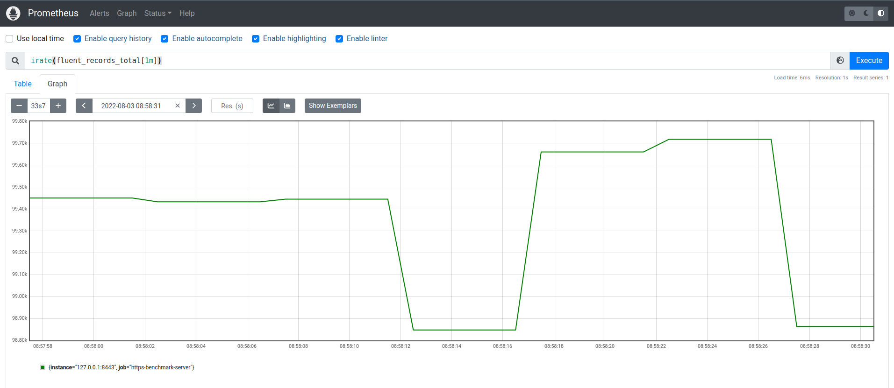

# Fluent HTTPs Benchmark Server

This is a HTTPs Server that measure the numbers of JSON records received per request. The metrics are printed to the terminal  interface and also exposed through a Prometheus endpoint `/metrics`.

The service works in the TCP/TLS port `8443`

There is a docker-compose stack provided the gives you an all-in-one example with Prometheus, Fluent Bit and this server:

```shell
docker compose up
```

A Dockerfile is provided as well to build and run the server easily.

```shell
$ docker build -t https-benchmark-server .
Sending build context to Docker daemon  195.1kB
Step 1/7 : FROM golang:1.18 as builder
 ---> 2d952adaec1e
Step 2/7 : WORKDIR /calyptia/https-benchmark-server
 ---> Using cache
 ---> 9b6f293b1670
Step 3/7 : COPY go.mod go.sum ./
 ---> Using cache
 ---> 689d8e0822e8
Step 4/7 : RUN go mod download && go mod verify
 ---> Using cache
 ---> a6ef9f48c476
Step 5/7 : COPY . .
 ---> 733895824568
Step 6/7 : RUN go build -o https-benchmark-server
 ---> Running in 08b842b5b02b
Removing intermediate container 08b842b5b02b
 ---> b192ea24bd11
Step 7/7 : CMD [ "./https-benchmark-server" ]
 ---> Running in 4b56cb36b983
Removing intermediate container 4b56cb36b983
 ---> 66ecb69b4f14
Successfully built 66ecb69b4f14
Successfully tagged https-benchmark-server:latest
$ docker run --rm -it -p 8443:8443 https-benchmark-server
2022/08/03 08:55:03 Starting server at https://127.0.0.1:8443
```

## Build and Run the Server

```shell
go mod download
go build
./https-benchmark-server
```

## Scrape Metrics with Prometheus

This repository provides a Prometheus configuration file ([prometheus-config.yml](prometheus-config.yml)) that can be used to scrape the metrics from the service.

Just run Prometheus from the command line:

```shell
prometheus --config.file=prometheus-config.yaml
```

To query the data in Prometheus dashboard:

- Go to <http://127.0.0.1:9090>
- Write the query: `irate(fluent_records_total[1m])`
- Click on the Graph Tab



## Ingesting data with Fluent Bit

Start the HTTPs Server in one terminal, in the other start Fluent Bit

```shell
fluent-bit -i dummy                  \
              -p rate=100000         \
           -o http://127.0.0.1:8443  \
              -p format=json_lines   \
              -p tls=on              \
              -p tls.verify=off      \
              -p workers=2           \
           -f 1
```

## Expected Output

In `https-benchmark-server` stderr you should see some stats like this:

```shell
$ ./https-benchmark-server
2020/12/27 23:11:55 Starting server at https://127.0.0.1:8443
metrics: 23:11:58.164353 counter records
metrics: 23:11:58.164377   count:           39266
metrics: 23:11:59.164347 counter records
metrics: 23:11:59.164363   count:          138395
metrics: 23:12:00.164288 counter records
metrics: 23:12:00.164307   count:          230671
metrics: 23:12:01.164367 counter records
metrics: 23:12:01.164385   count:          320348
metrics: 23:12:02.164410 counter records
metrics: 23:12:02.164424   count:          417787
metrics: 23:12:03.164350 counter records
metrics: 23:12:03.164367   count:          515907
metrics: 23:12:04.164378 counter records
metrics: 23:12:04.164392   count:          615270

```
